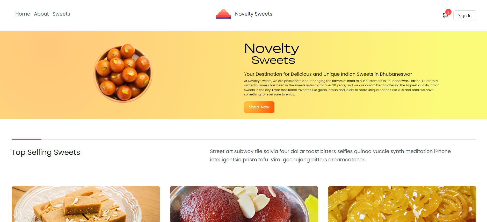
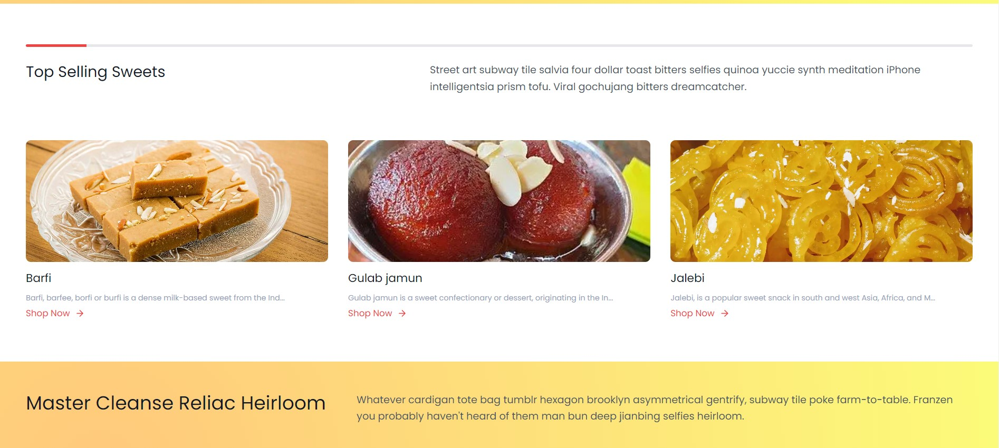
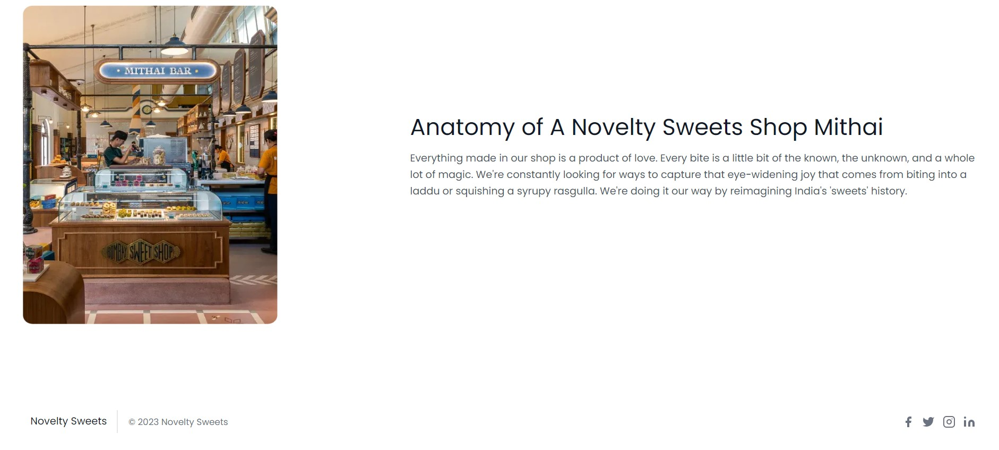
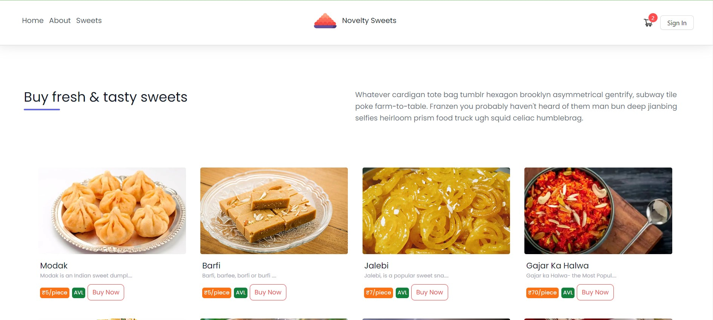
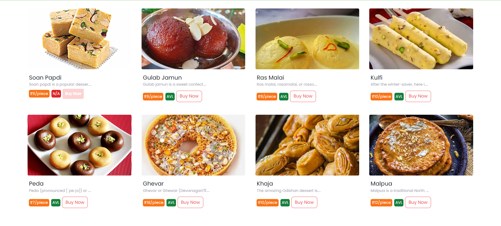
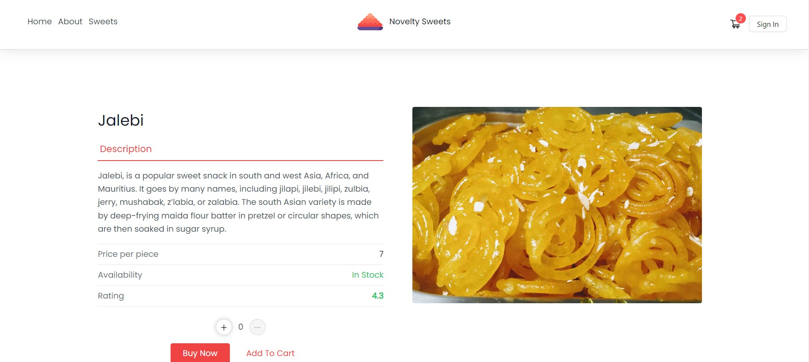
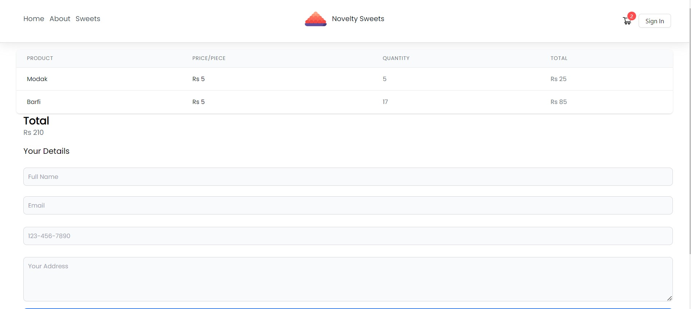

Novelty Sweets - 

## Description

Novelty Sweets is a ecommerce website for selling sweets. The website is fully responsive and works on all devices. 

## Tech Stack - 

- Next.js 
- Tailwind CSS
- Strapi CMS
- PostgreSQL

## Features -

- Authentication
- Cart
- Checkout
- Payment
- Admin Panel
- Product Management
- Order Management
- User Management
- Search
- Pagination
- Image Upload
- Responsive Design

## Installation

Clone the repository

```bash
git clone
```

Install dependencies

```bash
npm install
```

Start the development server

```bash
npm run dev
```

## Demo 
<h1>Demo is unavaiable at the moment as a Strapi & PostgreSQL backend can only be hosted on Heroku, AWS, Azure, etc. and not for free on Vercel or Netlify or any other hosting platform. <font color='red'>AND I DONT HAVE MONEY TO PAY SUCH HUGE BILLS :) .</font>So I have attached some screenshots of the app</h1>


## Screenshots

### Landing Page





### Products Page



### Product Page


### Cart Page



